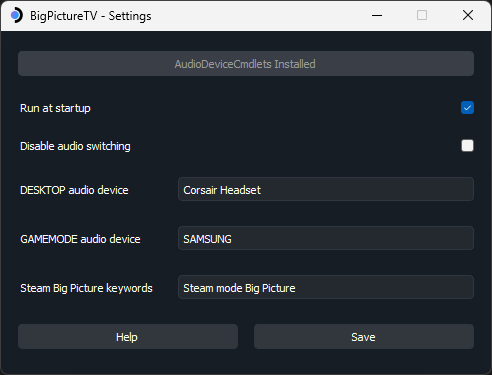
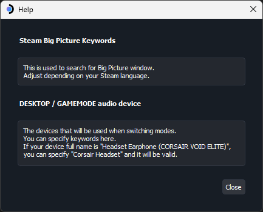

# BigPictureTV

This Python project automates switching between a monitor and a TV when launching Steam Big Picture on Windows.

⚠️ Exe built with pyinstaller. Windows defender may flag it. Either add an exception or do not use it. ⚠️

## Download

Head to [release](https://github.com/Odizinne/BigPictureTV/releases) section and grab the latest one.

## Requirements

**Runtime:**
- [AudioDeviceCmdlets](https://github.com/frgnca/AudioDeviceCmdlets) for audio output switching.
 
**Build dependencies:**
- Python
- PyQt5 (Ui)
- winshell (Startup shortcut manipulation)
- pygetwindow (Big Picture window detection)
- pystray (Tray icon)
- pyinstaller (Standalone exe creation)

`pip install pyqt5 winshell pygetwindow pystray pyinstaller`

## Build

Make sure you installed required dependencies. 

- Clone this repository `git clone git@github.com:Odizinne/BigPictureTV.git`. 
- Move inside the directory `cd BigPictureTV`. 
- Build the executable `pyinstaller BigPictureTV.spec`.

Since we're building with `console=False`, windows defender may not like it. You'll need to authorize the file.

## Todo

- code cleanup
