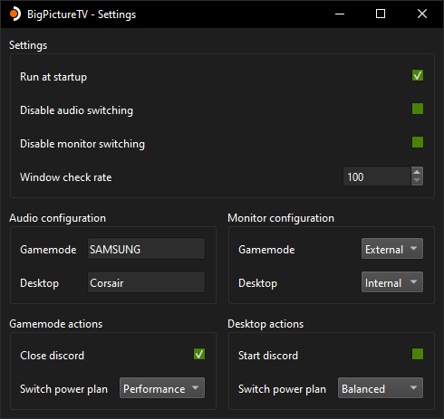

# BigPictureTV

[]()
[]()

This project automates switching between a monitor and a TV when launching Steam Big Picture on Windows.  
*Looking for the [linux version](https://github.com/Odizinne/BigpictureTV-Linux)?*

## Overview



## Requirements

**Runtime:**
- [Microsoft Visual C++ Redistributable](https://aka.ms/vs/17/release/vc_redist.x64.exe)
- [AudioDeviceCmdlets](https://github.com/frgnca/AudioDeviceCmdlets) for audio output switching.
 
## Download

### Using OdizinnePackageManager

- Install OPM
```
Invoke-Expression (New-Object System.Net.WebClient).DownloadString('https://raw.githubusercontent.com/Odizinne/opm/refs/heads/main/opm_install.ps1')
```

- Install BigPictureTV 
```
opm update
opm install BigPictureTV
```

BigPictureTV will be available in your start menu.

### Manual

Head to [release](https://github.com/Odizinne/BigPictureTV/releases/latest) section and grab the latest one.

Place the directory wherever you like (`%localappdata%\Programs` is a good one)

## Usage Instructions

- If you ever need to reset your settings, press alt key to open the menubar.

### Window Check Rate

- **Purpose:** Adjusts the interval for checking the presence of the Steam Big Picture window.
- **Range:** 100 ms to 1000 ms (default is 1000 ms).
- **Note:** 
  - **100 ms**: Minimal delay in mode switch but higher resource usage.
  - **1000 ms**: Default setting; balances performance and resource usage.
  - **Recommendation:** Do not change if unsure.

##

### Audio Configuration

1. **Install Audio Module**
   - Click on the "Install audio module" button.
   - Wait for the installation to complete.

2. **Configure Audio Switching**
   - Uncheck `Disable audio switching` once the module is installed.

3. **Specify Audio Outputs**
   - Use short names for audio outputs.
   - BigPictureTV will identify the correct output based on keywords.
   - Keep the names brief for better accuracy.

**Example:**

If you have a headset with the full name "CORSAIR VOID ELITE Wireless Gaming Dongle," you can simply specify "Corsair" as the audio output name. BigPictureTV will detect the correct output based on this keyword.

##

### Monitor Configuration

BigPictureTV uses Windows' built-in `displayswitch.exe` for monitor switching.

#### Available Modes

- **Internal:** Only the default monitor is enabled; all other monitors are disabled.
- **Extend:** Default monitor and selected additional monitors are enabled.
- **Clone:** All monitors are enabled and mirrored.
- **External:** Default monitor is disabled; only selected monitors are enabled.

#### Setting Up External Monitor (for more than two monitors)

1. **Set External Mode**
   - Press `Win + P` and select "External".

2. **Configure Desired Monitor**
   - Go to **Windows Settings** > **System** > **Displays**.
   - Disconnect all monitors except the one you want to use in game mode.

3. **Return to Previous Mode**
   - Press `Win + P` and switch back to "Internal" or "Extend".

**Alternative Option:**
- If you prefer not to configure monitors manually, select `Clone` in BigPictureTV settings.

### Actions

- Close discord in gamemode, start discord in desktop mode.
- Disable night light in gamemode, revert to previous state in desktop mode.
- Set performance power plan in gamemode, revert to previous state in desktop mode.

## I want to help

I need help for application translation.  
Currently done:
- EN
- FR

## To-do

- Clean code
- Optimize workflows further
- Action UI rework (it looks cluttered)

## Credits

- [nathanbabcock](https://github.com/nathanbabcock/nightlight-cli/tree/main) for night light toggle
