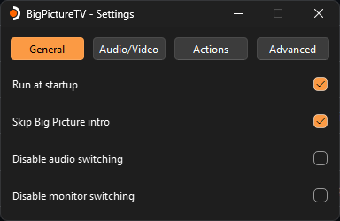

# BigPictureTV

[]()
[]()
[]()

⚠️ **Maintenance Only**  
This project is now in maintenance mode. While existing features will be supported and critical issues may be addressed, no new features or significant updates are planned.


## Overview

This project automates switching between a monitor and a TV when launching Steam Big Picture on Windows.  



## Requirements

**Runtime:**
- [Microsoft Visual C++ Redistributable](https://aka.ms/vs/17/release/vc_redist.x64.exe)

## Download

### Using OdizinnePackageManager (recommended)

- Install OPM

In powershell:

```powershell
Invoke-Expression (New-Object System.Net.WebClient).DownloadString('https://raw.githubusercontent.com/Odizinne/opm/refs/heads/main/opm_install.ps1')
```

- Install BigPictureTV

In powershell:

```
opm update
opm install BigPictureTV
```

BigPictureTV will be available in your start menu.

### Manual

Head to [release](https://github.com/Odizinne/BigPictureTV/releases/latest) section and grab the latest one.

Extract it and place the directory wherever you like.  
Run `BigPictureTV.exe`.

## Usage Instructions

### Window Check Rate

- **Purpose:** Adjusts the interval for checking the presence of the Steam Big Picture window.
- **Range:** 100 ms to 1000 ms (default is 1000 ms).
- **Note:** 
  - **100 ms**: Minimal delay in mode switch but higher resource usage.
  - **1000 ms**: Default setting; balances performance and resource usage.
  - **Recommendation:** Do not change if unsure.

##

### Audio Configuration

3. **Specify Audio Outputs**
   - Select your desired gamemode and desktop devices.  
   Disconnected devices are listed so you can select HDMI audio even if your HDMI TV is disconnected in windows.  
   On sound hardware changes (Disconnecting / reconnecting HDMI TV), it is possible that your audio output IDs changes. A reselection in configuration window might be necessary.

##

### Monitor Configuration

BigPictureTV uses Windows' built-in `displayswitch.exe` for monitor switching.

#### Available Modes

- **Internal:** Only the default monitor is enabled; all other monitors are disabled.
- **Extend:** Default monitor and selected additional monitors are enabled.
- **Clone:** All monitors are enabled and mirrored.
- **External:** Default monitor is disabled; only selected monitors are enabled.

#### Setting Up External Monitor (for more than two monitors)

1. **Set External Mode**
   - Press `Win + P` and select "External".

2. **Configure Desired Monitor**
   - Go to **Windows Settings** > **System** > **Displays**.
   - Disconnect all monitors except the one you want to use in game mode.

3. **Return to Previous Mode**
   - Press `Win + P` and switch back to "Internal" or "Extend".

**Alternative Option:**
- If you prefer not to configure monitors manually, select `Clone` in BigPictureTV settings.  
This is not optimal unless you manually set a FPS limit to your TV refresh rate in games.

### Actions

- Enable HDR in gamemode, disable HDR in desktop mode.
- Close discord in gamemode, start discord in desktop mode.
- Disable night light in gamemode, revert to previous state in desktop mode.
- Set performance power plan in gamemode, revert to previous state in desktop mode.
- Pause media (Spotify, Youtube...) in gamemode, restore them in desktop mode.

## Credits

- [nathanbabcock](https://github.com/nathanbabcock/nightlight-cli/tree/main) for night light toggle
- [res2k](https://github.com/res2k/HDRTray) for HDRCmd.exe
